# AIPlat — AI Gateway + FinOps

**One endpoint in front of every LLM provider, with the cost ledger built in.** Point your
application at AIPlat instead of at OpenAI, Anthropic or Amazon Bedrock, and you get routing,
caching, budget caps and guardrails in one place — plus a per-request record of what everything
cost and who spent it.

100% serverless: Go on AWS Lambda (ARM64), API Gateway, DynamoDB, SQS, EventBridge, Cognito and
Amazon Bedrock. Deployed per domain with Terraform, each domain holding its own state.

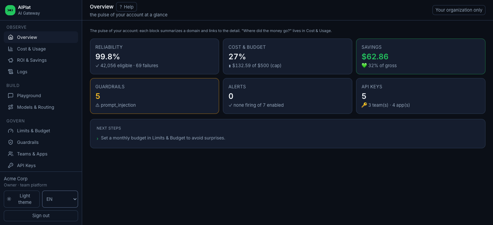

## Disclaimer

**This is a sample, published for reference and experimentation. It is not an AWS service and it
is not supported by AWS. Using it is at your own risk.** Read the code and the Terraform before
you put anything you care about behind it, and treat the defaults as a starting point rather than
a hardened configuration.

Specifically, before any production use:

- **`domains/*/envs/poc` is a proof of concept.** It is a single environment with a local
  Terraform backend, sized for iteration rather than operation. Production needs remote state
  with locking, separated environments, and your own review of every IAM policy in the modules.
- **You own the cost.** Lambda, API Gateway, DynamoDB, CloudFront and — usually the largest line —
  the model spend on Amazon Bedrock or whichever provider you configure are billed to your
  account. Set the cap under **Limits & Budget** before you hand the gateway to callers.
- **You own the security review.** [Security posture](#security-posture) lists what the Terraform
  configures. That is a description, not a compliance claim, and it has not been assessed against
  any framework.
- **No warranty of any kind.** See [LICENSE](LICENSE).

### Known limitations

- **First sign-in with MFA required.** The console does not implement the Cognito `MFA_SETUP`
  challenge. With the user pool at the default `mfa_configuration = "ON"` and a user who has not
  yet enrolled a TOTP factor, sign-in fails instead of guiding enrolment. Deploy with
  `mfa_configuration = "OPTIONAL"` for the first sign-in, enrol from **Settings → 2FA**, then move
  the pool back to `"ON"`.
- **Cost attribution is per request, not a billing reconciliation.** Figures come from the prices
  you declare per model, so they track your provider invoice only as closely as those prices do.
  Until you enter a negotiated price the console uses the provider list price and says so.
- **Savings are reported in two categories on purpose.** Only the verified ones are free of
  assumption — see [How savings are counted](#how-savings-are-counted) before quoting a number.

## Why

Once more than one team is calling models, three problems show up together and none of them are
model problems.

**Nobody knows where the money went.** The provider invoice is one number for the whole account.
Attributing it to a team, an app or a feature after the fact means reconstructing it from logs
that were never designed for accounting.

**Every service re-implements the same plumbing.** Retry, fallback to a second provider, timeout,
caching, PII masking. Written once per service, differently each time, and tested nowhere.

**Provider choice ossifies.** Swapping a model means a code change and a deploy in every caller,
so the swap never happens — even when a model that is 20× cheaper would answer the request just
as well.

AIPlat puts those three concerns in the request path, so they are configuration instead of code:

- 🔀 **Gateway, not a wrapper** — an OpenAI-compatible endpoint. Your SDK keeps working; you change
  `base_url` and nothing else.
- 💵 **Cost as a first-class record** — every request writes cost, tokens, latency, cache outcome and
  the team/app/feature it belongs to. The breakdown exists before the invoice does.
- 🧾 **A savings ledger that separates fact from estimate** — savings are split into *verified* and
  *counterfactual*, and never blended into one flattering number. See
  [how savings are counted](#how-savings-are-counted).
- 🎚️ **Config without redeploy** — routing order, prices, budget caps, rate limits, guardrails and
  the model allowlist all live in DynamoDB and take effect in roughly 15 seconds.
- 🛡️ **One policy point** — budget caps, per-scope rate limits and content guardrails apply to every
  caller, including the service someone shipped on Friday afternoon.
- 🏢 **Scopes that match an org chart** — `org → team → app`, resolved from the API key. A team can
  restrict what the org allows, never widen it.
- 🧬 **Isolated domains** — six independent Terraform stacks. One domain being unavailable degrades a
  feature; it does not take the gateway down.

## Feature tour

| | |
|---|---|
| **Cost & Usage** — spend by model, feature, team and app, with the cumulative curve and a per-provider table | 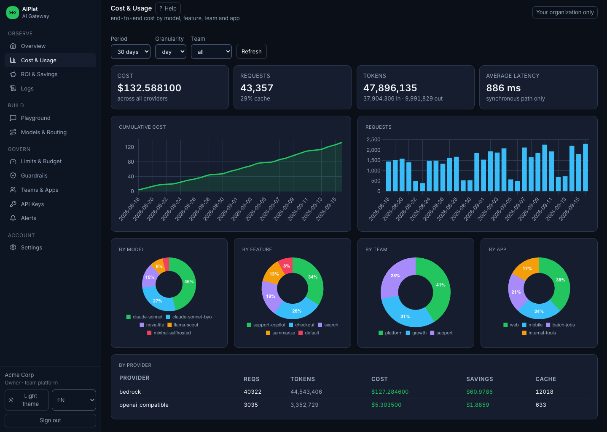 |
| **ROI & Savings** — savings per mechanism over time, split into verified and counterfactual | 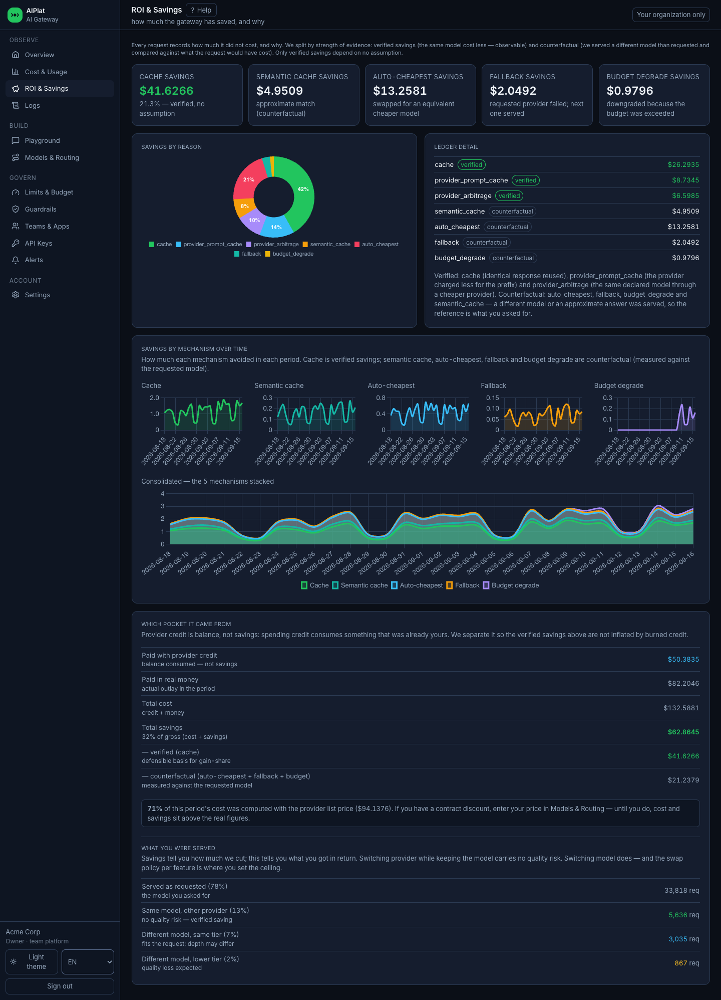 |
| **Models & Routing** — every model is an alias pointing at a provider; drag to set the fallback order, declare identity, enter your contract price | 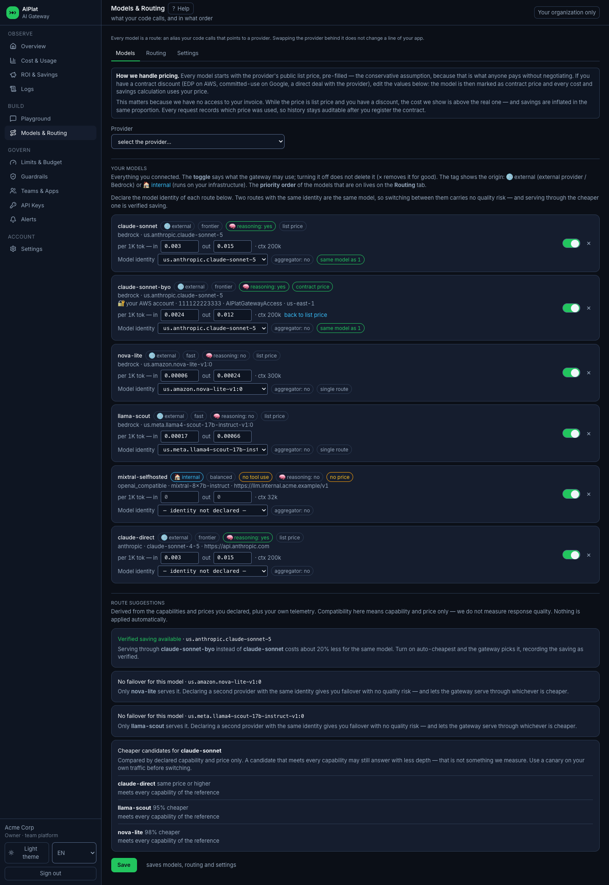 |
| **Logs** — per-request inspection: which model was asked for, which one served, the swap class, cost, latency and the failure reason | 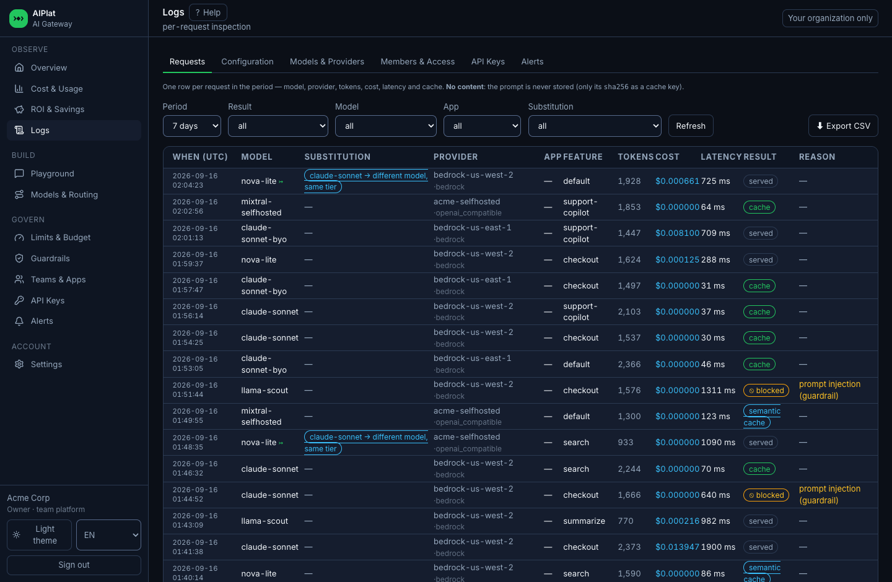 |
| **Audit trail** — control-plane history with field-level before/after, including actions taken by a platform operator | 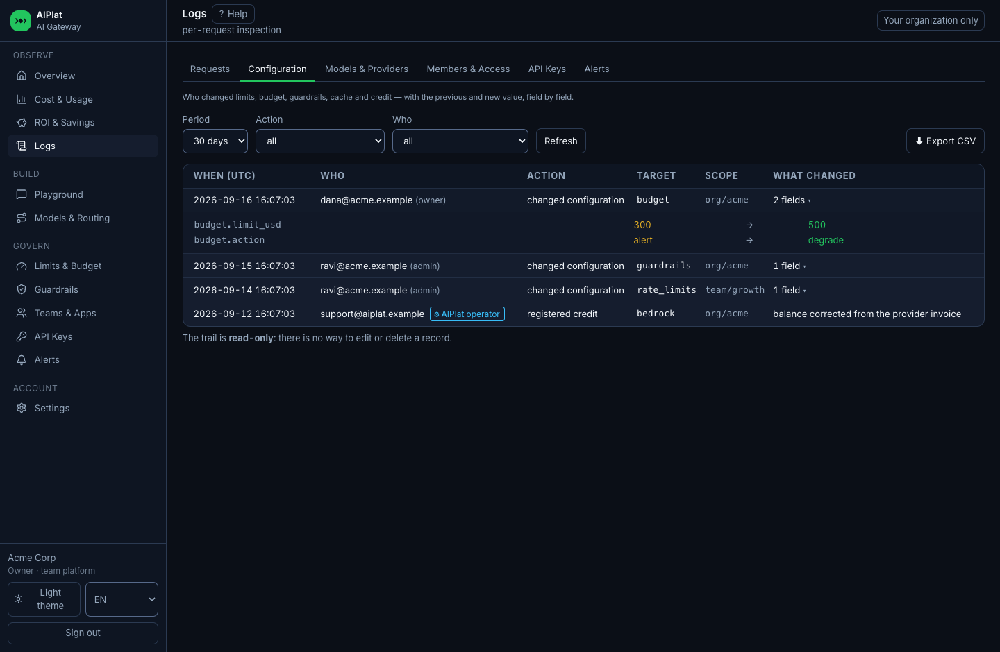 |
| **Limits & Budget** — rate limits, a monthly cap and the model allowlist, set at org, team or app scope | 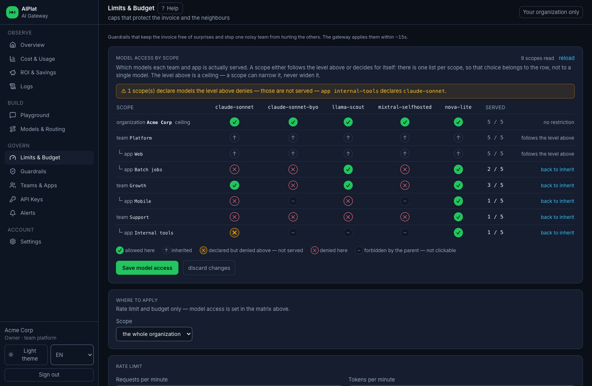 |
| **Guardrails** — PII masking, secret detection and prompt-injection blocking, applied before the request leaves the gateway | 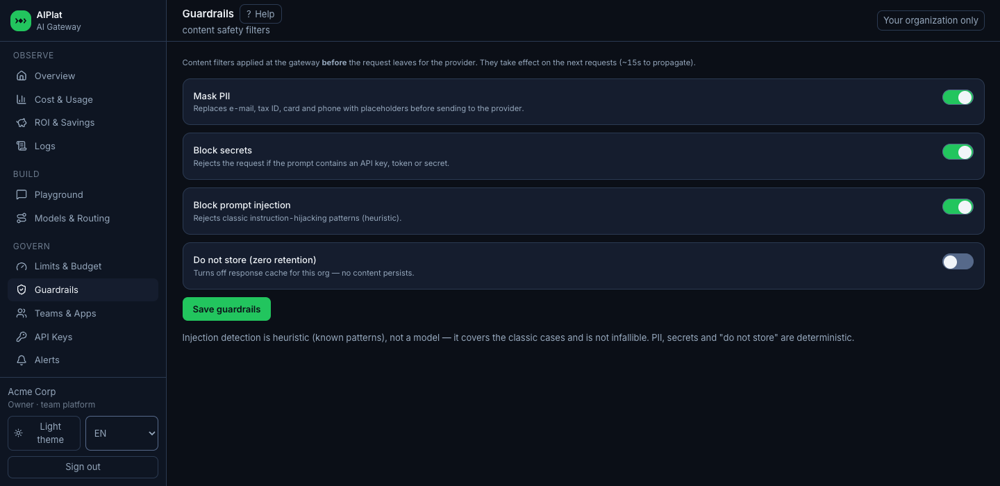 |
| **Teams & Apps** — the hierarchy that splits the cost, with membership and per-scope key counts | 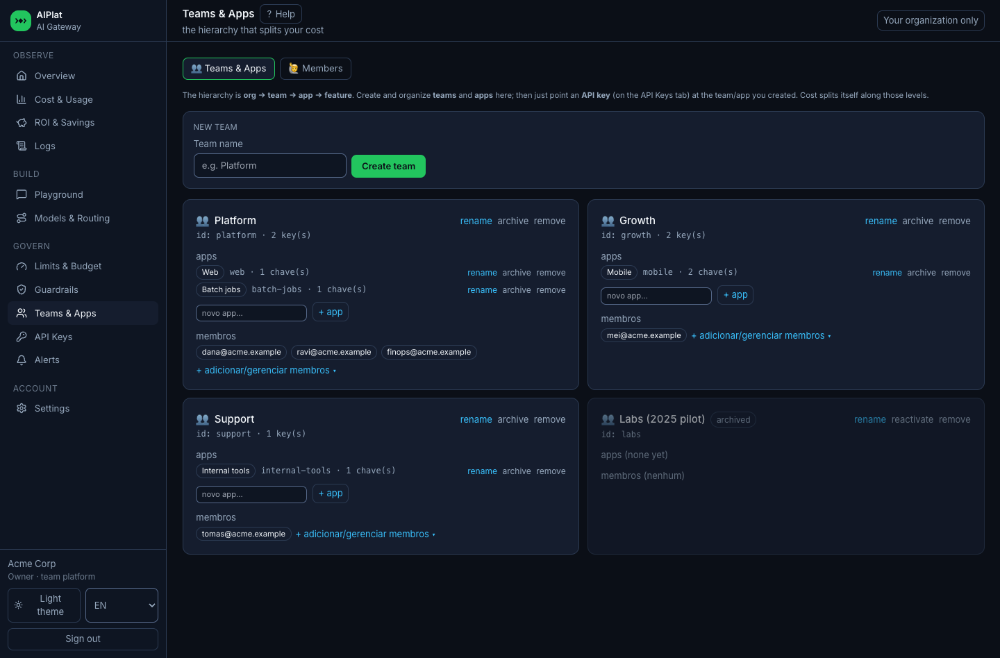 |
| **API Keys** — issue and revoke gateway keys per team and app; only the hash is stored | 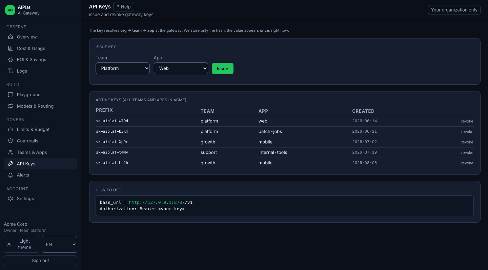 |
| **Alerts** — cost, latency, cache, error-rate, provider-capacity, SLO burn-rate and anomaly rules, delivered to a webhook | 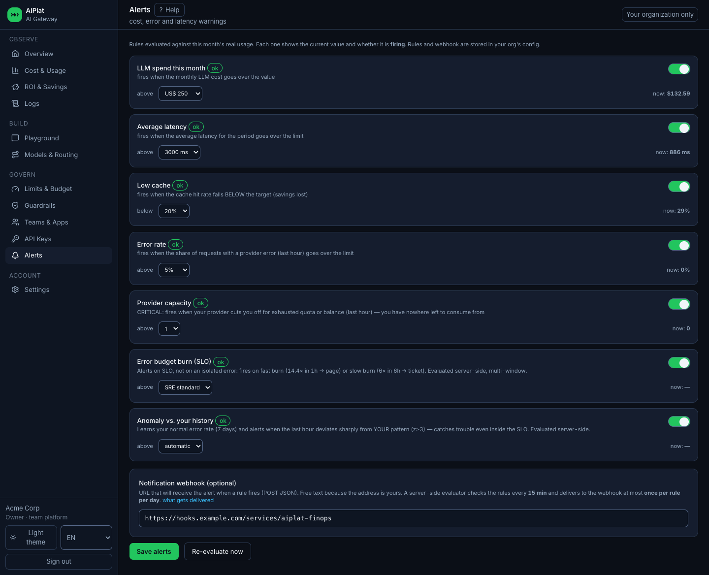 |
| **Playground** — send a prompt through the gateway and see the model actually served, the swap, the cost and the cache outcome | 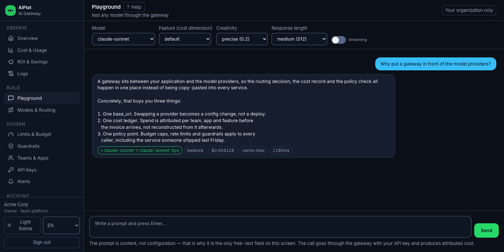 |
| **Settings** — organization profile, provider credit balance, 2FA enrolment and the gateway key for this browser | 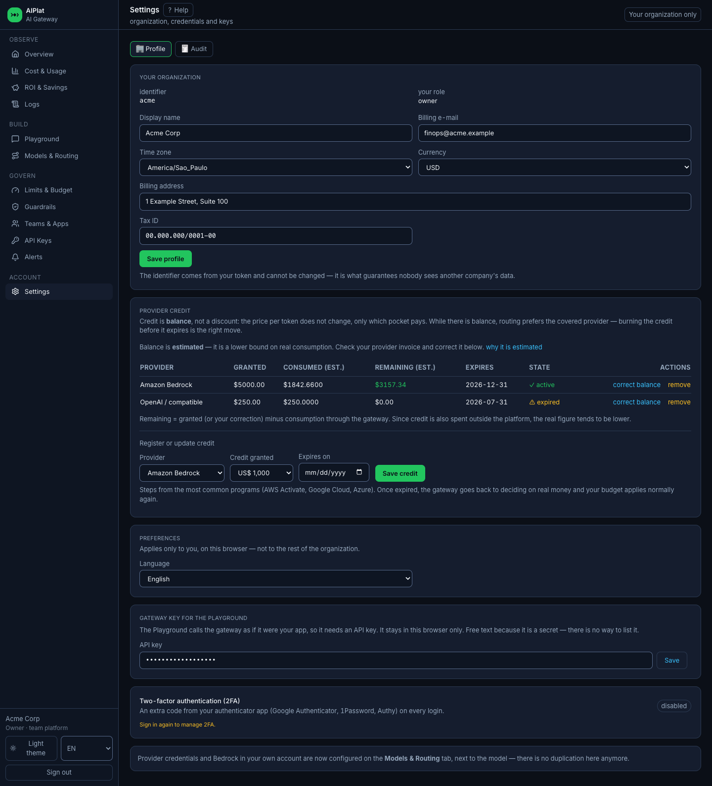 |

The console is a single static file on S3 behind CloudFront, with English, Portuguese and Spanish
built in. Every screenshot above was generated from synthetic data — see
[Run the console locally](#run-the-console-locally-no-aws).

## Calling the gateway

The gateway speaks the OpenAI dialect, so existing clients need one line changed.

```python
from openai import OpenAI

client = OpenAI(
    base_url="https://<gateway-id>.execute-api.<region>.amazonaws.com/prod/v1",
    api_key="<your-aiplat-key>",           # issued in the API Keys tab
)

resp = client.chat.completions.create(
    model="claude-sonnet",                 # your alias, not the provider's model id
    messages=[{"role": "user", "content": "Summarize this ticket."}],
    extra_body={"feature": "support-copilot"},   # optional: the cost dimension
)
```

`model` is **your** alias. What it resolves to — provider, region, account, exact model id — is
configuration, so moving `claude-sonnet` from the platform's Bedrock account to your own, or to a
different provider entirely, is a change in the console rather than in this code.

The response carries an `aiplat` block alongside the standard payload, so a caller can see what
actually happened:

```json
{
  "choices": [{ "message": { "role": "assistant", "content": "..." } }],
  "aiplat": {
    "model": "claude-sonnet-byo",
    "requested_model": "claude-sonnet",
    "provider": "bedrock",
    "estimated_cost_usd": 0.004128,
    "cache_hit": false,
    "latency_ms": 1180
  }
}
```

Streaming works the same way (`stream: true`, server-sent events).

## How savings are counted

Most gateways report one savings number. That number usually mixes two very different claims, and
the weaker one inflates it. AIPlat keeps them apart, in the API and on the screen.

**Verified** — no assumption required, because the request either was not sent or went to the
identical model:

| Mechanism | What happened |
|---|---|
| `cache` | An identical response was reused. The provider was never called. |
| `provider_prompt_cache` | The provider charged less for a repeated prefix. |
| `provider_arbitrage` | The **same** model served from a cheaper path — your own account, another region. |

**Counterfactual** — a *different* model served the request, so the saving is measured against what
the requested model would have cost. That comparison assumes the requested model was the real
intent:

| Mechanism | What happened |
|---|---|
| `semantic_cache` | A semantically close answer was reused instead of an identical one. |
| `auto_cheapest` | An equivalent cheaper model was chosen. |
| `fallback` | The requested provider failed and the next one served. |
| `budget_degrade` | The budget was exceeded, so routing dropped to a cheaper model. |

The Logs tab carries the same distinction per request as a **swap class**: `same_model` (provider
changed, no quality risk), `equivalent` (same tier or higher) and `downgrade` (lower tier, quality
loss expected). That is the answer to "what did this saving cost me in quality?", which a savings
total alone cannot give.

Costs are computed from the price you declare per model. Until you enter your negotiated price the
console uses the provider list price and says so, because list-price maths overstates both cost and
savings for anyone with a discount.

## Architecture

Six domains, one Terraform state each. They communicate through events and shared data stores, not
through synchronous calls to each other — which is why the cost pipeline being slow never adds
latency to a model request.

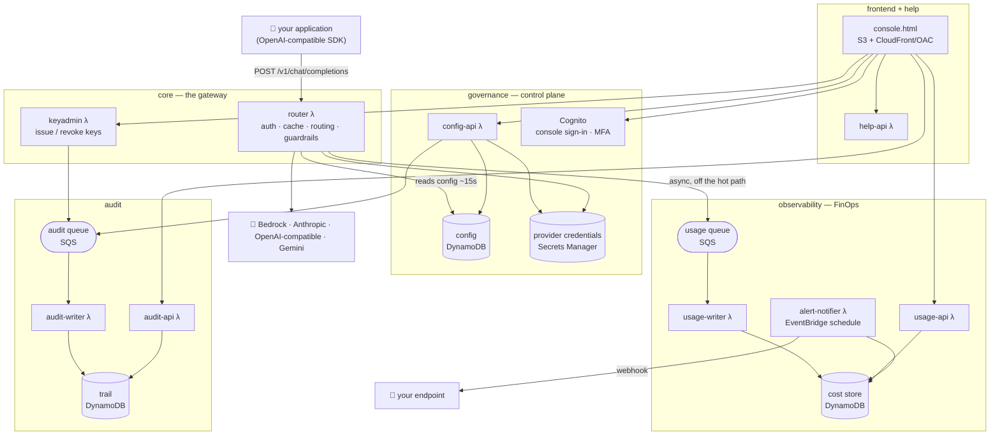

| Domain | Owns | Key components |
|---|---|---|
| `core` | The request path: tenant auth, model resolution, cache, routing with fallback and auto-cheapest, guardrails, OpenAI-dialect responses with SSE | `router`, `keyadmin` |
| `governance` | Dynamic config and provider credentials, org/team/app registry, members, Cognito sign-in | `config-api`, `pretoken` |
| `observability` | Usage capture off the hot path, cost store, savings maths, SLI/SLO, alert evaluation and delivery | `usage-writer`, `usage-api`, `alert-notifier`, `hints-publisher` |
| `audit` | Append-only control-plane trail with field-level diffs, CSV export, archival | `audit-writer`, `audit-api`, `audit-archiver` |
| `help` | In-console FAQ and internal deep-dives, in English, Portuguese and Spanish | `help-api` |
| `frontend` | The console as static content on private S3 behind CloudFront/OAC | `console.html`, WAF, response-header policy |

Every domain follows the same hexagonal layout. `internal/ports` declares the interfaces the
domain needs, `internal/adapters` implements them against DynamoDB, SQS, Secrets Manager, Bedrock
and the provider APIs, and the decision logic sits in packages that import none of it — `gateway`
and `routing` in core, `govcore` in governance, `savings` and `repository` in observability,
`auditcore` in audit, `help` in help. That separation is what lets the routing, savings and policy
logic be tested without mocking AWS.

## Quick start

Prerequisites: Terraform >= 1.9, Go >= 1.26, the AWS CLI configured, and Amazon Bedrock model
access enabled in the region you deploy to.

Two values have no default on purpose — a committed default becomes the real credential of an
account that can change budgets and read cost data:

```bash
export AWS_REGION=us-west-2
export TF_VAR_admin_token="$(openssl rand -hex 24)"        # >= 32 chars
export TF_VAR_seed_user_password="$(openssl rand -base64 18)"   # >= 16 chars
```

Deploy `core` first: it owns the account-level API Gateway CloudWatch role that the other domains'
access logging depends on. Then the rest in any order.

```bash
for d in core governance observability audit help frontend; do
  (cd "domains/$d" && bash build.sh)          # compile the Go Lambdas (arm64)
  (cd "domains/$d/envs/poc" && terraform init && terraform apply)
done
```

`build.sh` matters: Terraform only republishes a Lambda when `source_code_hash` changes, so a Go
change that was not rebuilt deploys nothing at all.

Then open the CloudFront URL from the `frontend` output, sign in with the seeded admin user, and
issue your first API key in the **API Keys** tab.

## Run the console locally (no AWS)

The console can run against a local fixture server — no AWS account, no credentials, no
deployment. This is also how every screenshot in this README is produced, which is why none of
them contain real data.

```bash
node demo/server.mjs
# open http://127.0.0.1:8787/console.html
```

`demo/fixtures.mjs` generates a deterministic 30-day dataset from a fixed seed: usage series,
per-request logs with every result and swap class, savings by mechanism, teams, members, keys,
credit balances and an audit trail. Same input, same numbers, so refreshing the screenshots
produces a real diff instead of noise.

To regenerate the images:

```bash
cd demo && npm install          # playwright
node capture.mjs                # writes ../assets/screenshots/*.png
# or reuse an installed Chrome instead of downloading Chromium:
BROWSER_CHANNEL=chrome node capture.mjs
```

The capture fails the run on any console error, so a broken view cannot quietly ship as a
screenshot.

## Security posture

What the deployed stack does by default. None of this is a compliance claim — it is the list of
controls the Terraform sets up, so you can check them against your own requirements.

- The gateway data plane authenticates with a hashed API key; only the prefix is ever stored or
  displayed. The control-plane APIs sit behind an API Gateway Cognito authorizer, with TOTP MFA
  required on the console user pool by default.
- Role-based access (`owner`, `admin`, `billing`, `dev`, `platform_admin`) is enforced server-side
  from the token claims; the console hides what a role cannot use, but the backend is the gate.
- CORS is deny-by-default: an origin has to be in the allowlist to get a response header.
- The console is private S3 behind CloudFront with OAC, a CSP and HSTS response-header policy, WAF
  in front, and its Tailwind build self-hosted rather than pulled from a CDN.
- All four SQS queues and the SNS topic are encrypted at rest, and all eight DynamoDB tables have
  point-in-time recovery enabled.
- Access logging is on for CloudFront and every API Gateway stage; control-plane mutations land in
  an append-only audit trail with field-level diffs, including anything a platform operator does.
- Provider credentials live in Secrets Manager and are never returned by an API or written to the
  audit trail. Bedrock can run cross-account against a role in *your* account, so the platform
  never holds your model credentials at all.
- Guardrails (PII masking, secret detection, prompt-injection blocking) run before the request
  leaves the gateway.

## Repository layout

```
domains/            six independent Terraform stacks, each with src/ tf/ envs/
  <domain>/src/     Go: cmd/<lambda>/ + internal/{ports,adapters,<domain logic>}
  <domain>/tf/       the reusable module
  <domain>/envs/poc/ the environment wrapper that instantiates it
demo/               local fixture server + screenshot capture (not deployed)
scripts/            operational tooling, load tests, i18n checks
testdata/           contract fixtures required by the Go tests
assets/screenshots/ the images used in this README
```

## Contributing

Issues and pull requests are welcome. Before opening a PR, build and test the domains you touched
and keep the Terraform formatted:

```bash
cd domains/<domain>/src && go build ./... && go test ./...
terraform fmt -check -recursive domains
```

See [CONTRIBUTING](CONTRIBUTING.md) for the full guidelines.

## Security

See [CONTRIBUTING](CONTRIBUTING.md#security-issue-notifications) for more information.

## License

This library is licensed under the MIT-0 License. See the LICENSE file.
